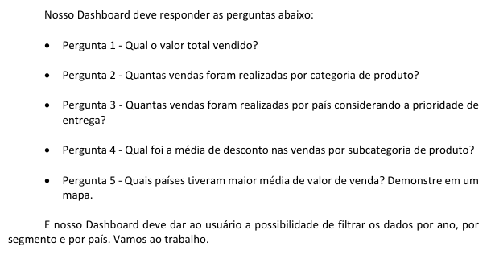
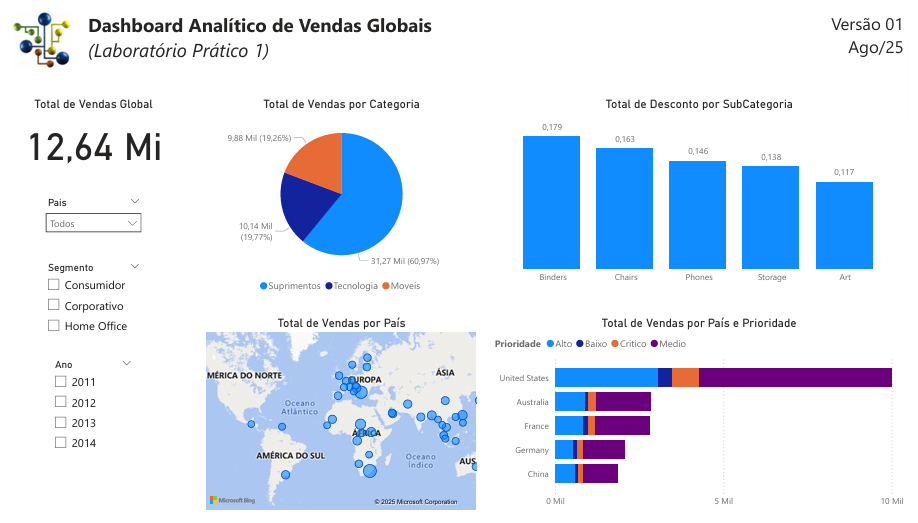

# Laboratório Prático 1 - Dashboard Analítico de Vendas Globais
Projeto do curso: "Microsoft Power BI Para Business Intelligence e Data Science", por [Data Science Academy](www.datascienceacademy.com.br).

## Sobre o Dataset
Dados de vendas de uma empresa fictícia que comercializa produtos em todos os cantos do 
mundo.

## Perguntas

## Dataviz

 

[Ver Dashboard online.](https://app.powerbi.com/view?r=eyJrIjoiY2NmZmUxMTgtMDBiNC00OWNlLWI5MmItMTdjNzAxYzk3ZjNmIiwidCI6IjY1OWNlMmI4LTA3MTQtNDE5OC04YzM4LWRjOWI2MGFhYmI1NyJ9)

[End]